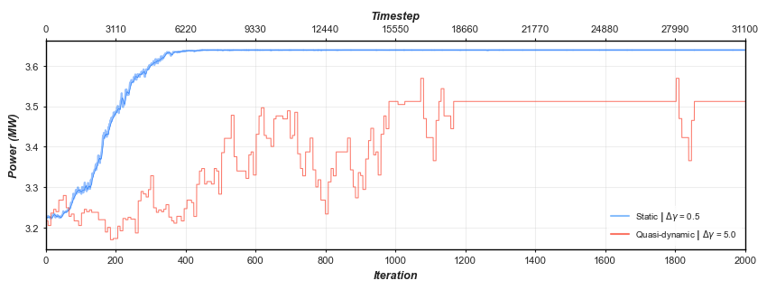

# Optimisation of Wake Steering Strategies Using Q-Learning 
:rocket: Blog post on personal website :link: [Reinforcement Learning for Offshore Wind Farm Optimisation](https://richardfindlay.co.uk/reinforcement-learning-for-offshore-wind-farm-optimisation-1)

<!--  -->
<p align="center">
  
  <figcaption style="font-size: 0.8rem;">screenshot of animation illustrating optimisation process in quasi-dynamic environment</figcaption>
</p>
<p align="center">
screenshot of animation illustrating optimisation process in quasi-dynamic environment
</p>


### Project Description :open_book::
This repository holds the coded implementation of a [conference paper published by NREL](https://www.nrel.gov/docs/fy20osti/75889.pdf), where there was no publicly available code, work was done to replicate some of the key components of the paper. The use case demonstrates the potential of how even rudimental Reinforcement Learning (RL) techniques can be applied to the wake steering control problem and can even lead to an improvement in performance when compared to traditional optimisation techniques. 

The code uses NREL's FLORIS - a control-oriented model traditionally used to investigate steady-state wake interactions in wind farm layouts - as a foundation to the using RL as the optimisation.

### Performance Overview :racing_car::
There are two distinct environments implemented for the problem, in which the q-learning optimisation is carried out for a 'static' environment, where there is no time dependency associated with wake propagation and is the conventional strategy adopted by the FLORIS. The second environment infers a temporal component to the optimisation, creating novel exploration of wake propagation in a RANs based solver and in effect producing a quasi-dynamic control environment and creating a more interesting insight to the formulation of the reward strategy for the problem.



The above illustrates the reward profiles observed during the training of the latterly described environments, with further insight available for the operation of the quasi-dynamic environment through the accompanying animation shown in the repository and in the [blog post](https://richardfindlay.co.uk/reinforcement-learning-for-offshore-wind-farm-optimisation-1).Through discretising the state space, q-learning has shown to yield effective results, surpassing improvements proposed by traditional optimisation techniques and packages.

### Notes on Code :notebook::
Install python dependencies for repository:
```
$ pip install -r requirements.txt
```

:weight_lifting: Training conducted locally on 2018 MacBook pro with 8GB RAM.

###  Further Work :telescope:: 
- [ ] Investigate the opportunities to pursue other RL techniques which may eliminate necessity to discretise state space and yield better optimisation strategies.
- [ ] Roll out optimisation to larger windfarm to validate practical use.
- [ ] Integrate and infer wind farm meta data (turbine choice, size, spacing etc.) to model and enable a more ambiguous optimisation strategy.

### To Do :test_tube:: 
- [ ] Code links and references to be validated since re-organisation.
- [ ] Further validate environments and optimisation scripts.

### Resources :gem:: 
+ [https://www.nrel.gov/docs/fy20osti/75889.pdf](https://www.nrel.gov/docs/fy20osti/75889.pdf)
+ [https://github.com/emerrf/gym-wind-turbine](https://github.com/emerrf/gym-wind-turbine)
+ [https://web.stanford.edu/class/psych209/Readings/SuttonBartoIPRLBook2ndEd.pdf](https://web.stanford.edu/class/psych209/Readings/SuttonBartoIPRLBook2ndEd.pdf)
